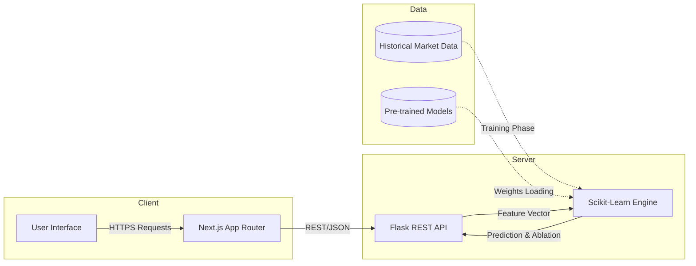
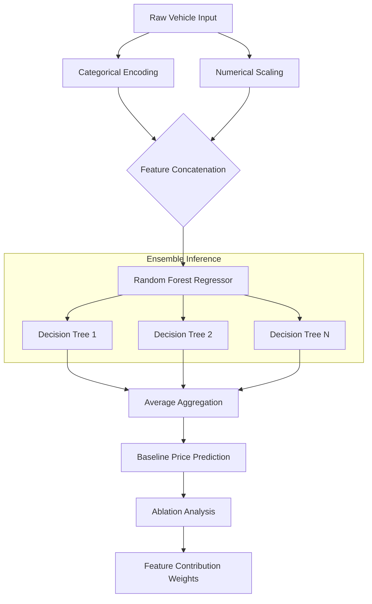
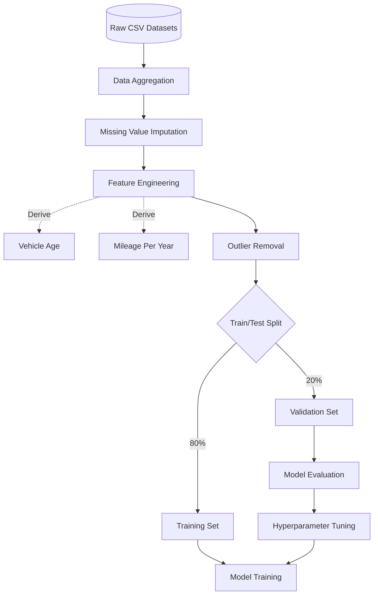

# MONOVALUATION
Advanced Vehicle Valuation Engine

Monovaluation is a high-performance machine learning platform designed to calculate precise market valuations for vehicles. By leveraging a comprehensive dataset of over 100,000 historical automotive records, the engine provides immediate, AI-driven price estimations, vehicle comparisons, and granular value driver ablations.

## System Architecture

The platform operates on a decoupled architecture, utilizing a Next.js React frontend for the user interface and a Python Flask backend for model inference and data processing.

## Machine Learning Pipeline

The valuation engine is built upon a Random Forest Regressor ensemble model. It excels at capturing complex, non-linear relationships within the automotive market, such as the compounding depreciation effects of mileage and vehicle age.

## Data Processing Workflow

The integrity of the machine learning model relies on rigorous data processing. The raw dataset, comprising over 100,000 records from manufacturers such as Audi, BMW, Mercedes, and VW, is engineered to prevent data leakage and maximize feature correlation.

## Core Features

- Estimator: Calculates the precise market value of a single vehicle based on make, model, age, mileage, and engine size.
- Comparison: Analyzes two vehicles head-to-head to determine differing brand premiums and specification valuations.
- Value Drivers: Deconstructs the final price using ablation technology to isolate exactly how much value is added or lost due to specific features.
- Market Insights: Explores macro trends across the dataset, visualizing brand distributions and average price depreciation curves.

## Technology Stack

- Frontend: Next.js, React, Tailwind CSS, Framer Motion
- Backend: Python, Flask
- Machine Learning: Scikit-Learn, Pandas, NumPy
- Deployment: Vercel (Frontend), Render (Backend)
